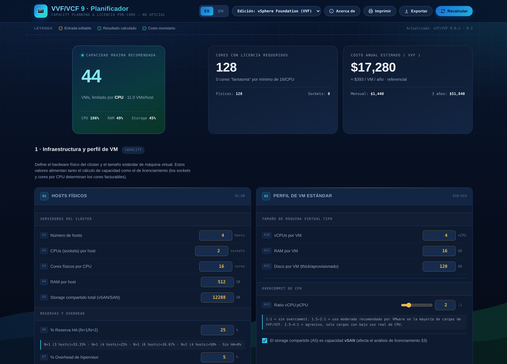

<div align="center">

# VVF/VCF 9 Planner

**Capacity planning & per-core licensing calculator for VMware vSphere Foundation (VVF) and VMware Cloud Foundation (VCF) 9.x**

[](./LICENSE)
[](./LICENSE-GPLv3)
[]()
[]()
[](./CONTRIBUTING.md)
[]()

[Live demo](#-live-demo) · [Features](#-features) · [Quick start](#-quick-start) · [Formulas](#-how-the-math-works) · [Contributing](#-contributing) · [License](#-license) · [Author](#-author)

</div>

<br>

<p align="center">
  
</p>

<br>

## What is this?

A single self-contained `index.html` — no build step, no dependencies, no backend — that helps VMware infrastructure teams answer two questions at once:

1. **How many VMs can this cluster actually run?** (capacity planning: hosts, sockets, cores, RAM, shared storage, HA reserve, hypervisor overhead, CPU overcommit)
2. **What will it cost to license it?** (per-core licensing under Broadcom's VVF/VCF 9.0+ model, including the official 16-core-per-physical-CPU minimum, phantom-core exposure, vSAN entitlement, and a side-by-side VVF vs. VCF vs. VCF Edge comparison)

It ships with an English/Spanish language toggle, a Google search shortcut, and a "copy question + cluster context, then open Claude" helper — so a planning conversation never has to leave the page.

> **Unofficial project.** Not affiliated with, endorsed by, or sponsored by Broadcom Inc. or VMware. VMware, vSphere, vSAN, NSX, and Cloud Foundation are trademarks of Broadcom Inc. and/or its subsidiaries. Built as an open contribution to the VMware community — see [Disclaimer & data sources](#-disclaimer--data-sources).

## 🔗 Live demo

Once you publish this repo, enable **GitHub Pages** (Settings → Pages → Deploy from branch → `main` / `root`) and your live URL will be:

```
https://aeternax-suite.github.io/VCF-9-Planificador/
```

A ready-made deploy workflow is already included at `.github/workflows/pages.yml` — it publishes automatically on every push to `main`.

## ✨ Features

- **Capacity engine** — hosts × sockets × cores-per-socket, RAM, shared storage, HA/N+1/N+2 reserve, hypervisor overhead, and CPU overcommit ratio, all feeding a bottleneck-aware "max recommended VMs" calculation.
- **Per-core licensing engine** — applies Broadcom's official 16-core-per-physical-CPU minimum (8 for VCF Edge), surfaces "phantom cores" you're paying for but don't physically have, and computes annual/monthly/3-year/5-year cost.
- **vSAN entitlement check** — compares included vSAN capacity (TiB per licensed core) against requested storage and flags whether an add-on purchase is needed.
- **Edition comparator** — VVF vs. VCF vs. VCF Edge on identical hardware, with an automatic recommendation driven by whether you need NSX / HCX / Aria Automation.
- **Scenario A/B comparison** — size two candidate clusters side by side, including licensing cost.
- **Editable pricing** — per-core prices and vSAN entitlements are inputs, not hardcoded assumptions (Broadcom does not publish a public price list — see disclaimer below).
- **EN/ES language toggle**, quick presets (small/medium/large cluster), print-to-PDF, and a plain-text export of the full calculation.
- **Ask Claude** box — copies your question plus the full cluster context to the clipboard and opens a new claude.ai tab.
- **Google search** box — jumps straight to Broadcom/VMware official documentation.
- **Zero dependencies** — one HTML file, Google Fonts via CDN, no build tooling, no tracking, no backend.

## 🚀 Quick start

```bash
git clone https://github.com/Aeternax-Suite/VCF-9-Planificador.git
cd VCF-9-Planificador
open index.html   # macOS — or just double-click it, or drag it into a browser tab
```

No install step. It's a single HTML file — open it locally, host it on GitHub Pages, drop it on any static file server, or embed it on an internal wiki/Confluence page.

## 🧮 How the math works

### Capacity

```
usable_cores   = (hosts × sockets × cores_per_socket) × (1 − HA_reserve − hypervisor_overhead)
usable_ram     = (hosts × ram_per_host)                × (1 − HA_reserve − hypervisor_overhead)
usable_storage =  shared_storage                        × (1 − hypervisor_overhead)

max_by_cpu     = floor(usable_cores   / vCPU_per_vm × overcommit_ratio)
max_by_ram     = floor(usable_ram     / ram_per_vm)
max_by_storage = floor(usable_storage / disk_per_vm)

max_vms        = min(max_by_cpu, max_by_ram, max_by_storage)   ← the bottleneck
```

### Licensing (VVF / VCF 9.0+, per Broadcom's official model)

Broadcom licenses **per physical core**, with a **minimum of 16 cores per physical CPU** (8 for VCF Edge). A CPU socket with fewer physical cores than the minimum is still billed as if it had the minimum:

```
licensed_cores_per_socket = max(physical_cores_per_socket, minimum)   # 16, or 8 for VCF Edge
total_licensed_cores      = total_sockets × licensed_cores_per_socket
phantom_cores              = total_licensed_cores − total_physical_cores
annual_cost                = total_licensed_cores × price_per_core_per_year
```

This has been validated against Broadcom's own worked examples (e.g. a 2×8-core-CPU host is billed as 32 cores, not 16) and against three independently published real-world sizing examples (3/8/20-node clusters), which reproduce exactly.

Sources: [Broadcom TechDocs — VCF 9.0+ Licensing Model](https://techdocs.broadcom.com/us/en/vmware-cis/vcf/vcf-9-0-and-later/9-0/licensing/licensing-overview/licensing-model.html) · [Broadcom TechDocs — Licensing Overview (9.1)](https://techdocs.broadcom.com/us/en/vmware-cis/vcf/vcf-9-0-and-later/9-1/licensing/licensing-overview.html) · [VMware — VCF 9.1 General FAQ](https://www.vmware.com/docs/vmware-cloud-foundation-9-1-general-faqs) · [VMware — VCF 9.1 Feature Comparison & Upgrade Paths](https://www.vmware.com/docs/vmware-cloud-foundation-9-1-feature-comparison-and-upgrade-paths)

## ⚠️ Disclaimer & data sources

The **licensing rules** (per-core model, 16-core/8-core minimum) come straight from Broadcom's official technical documentation, linked above.

The **per-core prices** and **vSAN entitlements** pre-filled in the tool are **market reference estimates** reported by channel partners/analysts as of 2026 — Broadcom does not publish a public price list, and real pricing varies by region, volume, and negotiation. Every price field is editable; treat the defaults as a starting point, not a quote, and confirm with your Broadcom representative or authorized partner before budgeting.

## 🗂 Repository structure

```
.
├── index.html                    # the entire app — open this
├── docs/
│   └── screenshot.png            # README screenshot
├── .github/workflows/pages.yml   # auto-deploy to GitHub Pages on push to main
├── LICENSE                       # MIT (primary)
├── LICENSE-GPLv3                 # GNU GPLv3 (alternative — see note inside)
├── CONTRIBUTING.md
├── CODE_OF_CONDUCT.md
└── CHANGELOG.md
```

## 🤝 Contributing

Issues and PRs are welcome — see [CONTRIBUTING.md](./CONTRIBUTING.md). This project exists to be improved by the VMware community: corrected formulas, updated pricing references, new editions/add-ons (Ransomware Recovery, Advanced Cyber Compliance, Private AI Foundation), and translations are all great first contributions.

## 📄 License

Dual-licensed — use whichever fits your project:

- [MIT License](./LICENSE) (permissive)
- [GNU GPLv3](./LICENSE-GPLv3) (copyleft)

`SPDX-License-Identifier: MIT OR GPL-3.0-or-later`

## 👤 Author

**Mario Tabuada Mussio**
IT Ambassador · Instructor · IT Consultant · VMware & Citrix Solutions Architect · AWS EVS · Cloud Specialist · VVF-VCF-SDDC · Cisco CCNA+Sec · AVIXA CTS · Scrum SFC & PMI · DevSecOps · CyberSecurity Specialist · VMware vExpert 2026 · VMUG Team Leader · Editor TechNews Today · Broadcom Social Media Advocacy

- ✉️ [mario.tabuada@outlook.com](mailto:mario.tabuada@outlook.com)
- 📱 Mobile (+506): 8745-3670
- 🤖 AI Phone: +1 (301) 264-9324

<br>

<div align="center">

Built as a contribution to the VMware by Broadcom community.

</div>
